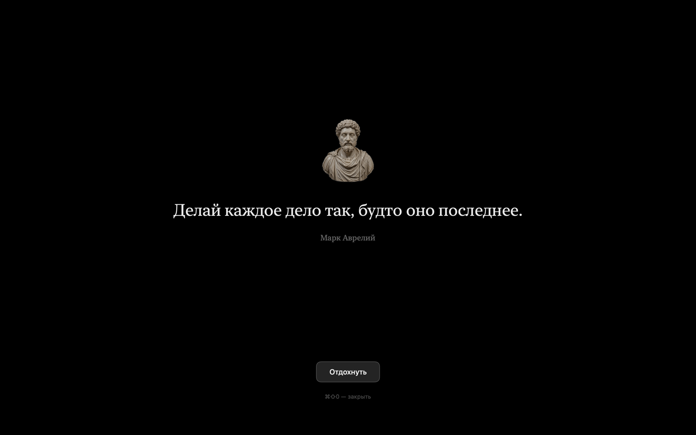
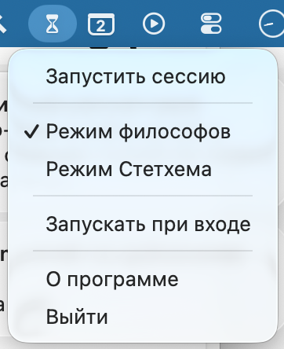

# Clepsydra

Помодоро-таймер в меню-баре macOS: 25 минут работы, 5 минут перерыва и
полноэкранный экран с цитатой между ними.



Второй режим показывает вместо философов пацанские цитаты наклейками.
Фотографий в репозитории нет, права на них не наши: свои PNG кладут
в `Resources/statham/`.


Всё остальное время приложение живёт в меню-баре: иконка, отсчёт до конца
интервала и короткое меню. В Dock и переключателе задач его нет.



## Установка

Нужны Mac на Apple Silicon с macOS 14 и Command Line Tools
(`xcode-select --install`); полный Xcode не требуется.

```bash
git clone https://github.com/ilya-pesterev/clepsydra.git
cd clepsydra
./build.sh
cp -R Clepsydra.app /Applications/ && open /Applications/Clepsydra.app
```

---

[docs/development.md](docs/development.md) — как всё устроено и собирается.
[CONTEXT.md](CONTEXT.md) — язык проекта, [docs/adr/](docs/adr/) — решения.
